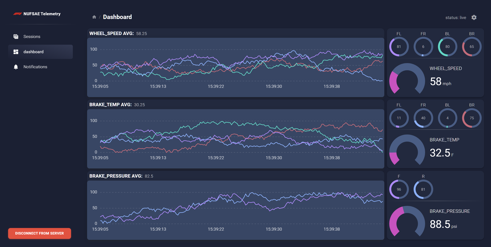

# Telemetry Remote NFR23

## Getting Started

execute the `initApp.bat` file from file explorer. Close the command prompt windows after completion.

## Usage

execute the `runApp.bat` file from file explorer. If you need to restart the app, remember to close all command prompt windows before running the `runApp.bat` file again.
 
The instructions below can also be found in the settings page of the app. (Click top right gear icon)

### Controls
- w/s: Zoom in/out on graphs
- a/d: pan left/right on graphs
- shift + W/A/S/D: zoom/pan 10x faster
- shift + R: resume live scrolling

### Connecting to live data
1. Click connect to server.
2. Navigate to sessions page. Select session or create one
3. Data is live. Pan/zoom enabled

### F*ck. Things are broken
Try the below fixes in order.  
Need to reslect the same session after.  
(unless you restart the whole app)

1. Switch tabs on the side nav.
2. Disconnect and reconnect to server.
3. Refresh the tab.
4. Relaunch the app entirely. 
5. Ping on slack.

### For Future Developers
## Stack
- backend: nodeJS, express, socket-io
- client: React (JS), socket-io, chart.js, material design components
## Features to add
- more data visualization components: map, gauges, bar chart
- add a field for metadata for each sensor instead of hard coding all parameters
    - i.e. sensor: {name, value, time metadata:{speed, type, wheel, ... etc.}} instead of having a unique field for each new thing we need to keep track for
    - can allow architecture to be more easily adapted to new sensors
- add notification snackbars for server side events to display on the frontend (more indication of what's actually going on)
- need to send sql databases onto the dynamodb and match their schemas (super annoying)
- add unique dashboard for each subteam
- allow the graphs to be updated independently from each other 

## Bugs to fix
- the scrolling and panning on the graphs are not perfect
    - overall need better user interaction
- performance on rendering the graphs is still an issue (data decimation?)

## Big Overhauls
- Attach node js server directly to the front end, no need to run a separate backend server
- Develop a native desktop app/program for performance instead of running the entire thing on the browser (C++?)
